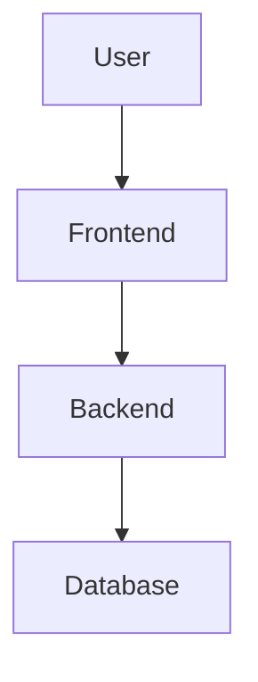

# Merhaba
Bu proje octoware için önemlidir
## sasa
bu projeyi ben yaptım 'print("ben yaptım")'
### merhaba

1. Ata
2. OctoWare
    1. selam

[openai](https://www.openai.com)

`print("helloworld")`


---

## 🔹 Alıntı (Quote)
```markdown
> Bu bir alıntı örneğidir.
>> İç içe alıntı da yapılabilir.
```
| Ad | Yaş | Şehir |
|-|-|-|
| Ata | 21 | Bursa |
| Merve | 22 | Ankara |
___

- [x] Kurulum tamamlandı
- [ ] Dokümantasyon yazılacak
- [ ] Test edilecek
____

<details>
<summary>Kral burası katlanıyor </summary>


Buraya gizli içeriği yazabilirsin.
Kod, görsel veya uzun açıklama olabilir.

</details>





